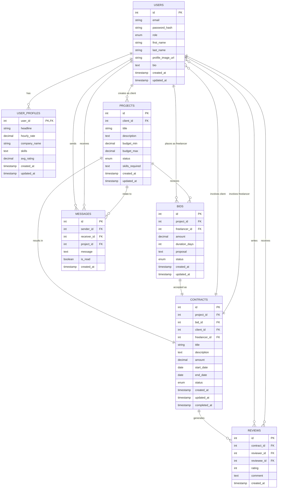

```mermaid
erDiagram
    USERS {
        int id PK
        string email
        string password_hash
        enum role
        string first_name
        string last_name
        string profile_image_url
        text bio
        timestamp created_at
        timestamp updated_at
    }
    
    USER_PROFILES {
        int user_id PK,FK
        string headline
        decimal hourly_rate
        string company_name
        text skills
        decimal avg_rating
        timestamp created_at
        timestamp updated_at
    }
    
    PROJECTS {
        int id PK
        int client_id FK
        string title
        text description
        decimal budget_min
        decimal budget_max
        enum status
        text skills_required
        timestamp created_at
        timestamp updated_at
    }
    
    BIDS {
        int id PK
        int project_id FK
        int freelancer_id FK
        decimal amount
        int duration_days
        text proposal
        enum status
        timestamp created_at
        timestamp updated_at
    }
    
    CONTRACTS {
        int id PK
        int project_id FK
        int bid_id FK
        int client_id FK
        int freelancer_id FK
        string title
        text description
        decimal amount
        date start_date
        date end_date
        enum status
        timestamp created_at
        timestamp updated_at
        timestamp completed_at
    }
    
    REVIEWS {
        int id PK
        int contract_id FK
        int reviewer_id FK
        int reviewee_id FK
        int rating
        text comment
        timestamp created_at
    }
    
    MESSAGES {
        int id PK
        int sender_id FK
        int receiver_id FK
        int project_id FK
        text message
        boolean is_read
        timestamp created_at
    }

    USERS ||--o{ PROJECTS : "creates as client"
    USERS ||--o{ USER_PROFILES : "has"
    USERS ||--o{ BIDS : "places as freelancer"
    PROJECTS ||--o{ BIDS : "receives"
    PROJECTS ||--|| CONTRACTS : "results in"
    BIDS ||--|| CONTRACTS : "accepted as"
    CONTRACTS ||--o{ REVIEWS : "generates"
    USERS ||--o{ MESSAGES : "sends"
    USERS ||--o{ MESSAGES : "receives"
    PROJECTS ||--o{ MESSAGES : "relate to"
    USERS ||--o{ REVIEWS : "writes"
    USERS ||--o{ REVIEWS : "receives"
    CONTRACTS ||--o{ USERS : "involves client"
    CONTRACTS ||--o{ USERS : "involves freelancer"
```